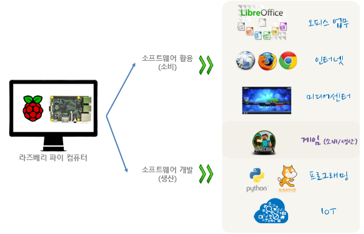

> ### 학습 목표 {.objectives}
>
> *  라즈베리 파이로 할 수 있는 것들을 알아본다.

### 1. 라즈베리 파이(Raspberry Pi) 

[아두이노](https://www.arduino.cc/)와 더블어 가장 많이 한국에서 회자되는 라즈베리파이는 아두이노와 달리 운영체제가 탑재되어 있으며 [라즈베리 파이 재단](https://www.raspberrypi.org/)에서 운영하고 있다. 단순히 컴퓨터 하드웨어를 목적으로 하지 않고 컴퓨터를 처음 접하는 모든 사람에게 컴퓨터에 대한 올바른 교육을 목표로 하다보니 처음 라즈베리 파이를 접하는 분들은 다소 생소할 수 있다. 왜냐하면 외장도 없고 하드디스크도 없고, 물론 마우스와 키보드도 없다. 하지만 외장도 없다보니 컴퓨터의 본질에 대해 제대로 접할 수 있고, 사실 필요성을 느끼지 못할 뿐이지 마음만 먹으면 라즈베리파이, 컴퓨터를 통해서 상상할 수 있는 모든 것을 할 수도 있다. [라즈트랙](http://www.rastrack.co.uk/)에서 전세계적으로 라즈베리파이가 얼마나 뿌려졌고 사용되고 있는지 확인할 수도 있다. 

### 2. 라즈베리 파이로 할 수 있는 것들

라즈베리 파이에 운영체제를 올리게 되면 그 운영체제에 맞는 다양한 응용프로그램을 통해서 다양한 작업을 수행할 수 있다.

라즈베리 파이 하드웨어를 갖게되면 다양한 소프트웨어를 설치해서 글을 작성하고, 계산을 하고, 발표 준비를 하고, 데이터관리 등 오피스 작업을 수행할 수 있고, 인터넷을 사용해서 정보를 찾고 다양한 SNS 서비스를 사용하고, 미디어센터를 활용하여 고급 멀티미디어 감상도 가능하다. 라즈베리 파이에 설치되어 있는 게임도 즐길 수 있으면, 직접 마인크래프트 게임을 만들 수도 있다. 

파이썬과 스크래치가 기본으로 설치되어 있어 별도 설정없이도 소프트웨어 개발이 가능하고, 라즈베리 파이가 갖고 있는 GPIO를 활용하여 사물인터넷 IoT 개발도 가능하다.

### 3. 라즈베리 파이 내부

[피터 노톤의 IBM PC의 안쪽](https://archive.org/details/Peter_Norton_Inside_the_IBM_PC_Revised_and_Enlarged)으로 국내에서도 널리 알려진 책이 있다. 라즈베리 파이 내부를 동일한 방식으로 살펴보는 것도 추천한다. 

> #### 라즈베리 파이 구성 {.prereq}
>
> * __주요 구성부품__
>     1. 라즈베리 파이 본체 X 1
>     1. 마이크로 SD 카드 (8G 이상) X 1
>     1. 마우스와 키보드 X 1
>     1. 모니터 X 1
> * __연결 구성부품__
>     1. HDMI 연결선 X 1
>     1. 5V 전원 연결선 혹은 USB 케이블 X 1
>     1. 이더넷 케이블 혹은 와이파이 동글 X 1
      
가장 중요한 핵심 부품은 라즈베리 파이 본체로 먼저 전원을 공급해야 하기 때문에 5V 어댑터가 필요하지만 라즈베리 파이는 USB 로도 전원공급이 가능해서 별도 5V 어댑터 대신에 USB를 통해 전원을 공급한다. 마치 핸드폰을 어댑터 혹은 USB로 충전하는 것을 생각하면 쉽다. 

라즈베리 파이를 제어하기 위해서는 입출력 장치가 필요한데 USB 포트가 4개(라즈베리 파이 2 기준) 장착되어 있어 마우스와 키보드를 각각 설치한다. CLI를 통한 입력으로 키보드를 사용하는데 GUI 제어를 위해서 마우스를 사용한다.
출력장치로 HDMI 단자를 이용하여 HDMI 단자가 달려있는 모니터, TV, 다른 디스플레이를 라즈베리 파이 출력 화면으로 사용한다. HDMI 단자를 사용하면 소리정보도 전송되기 때문에 별도 스피커 설치를 생략할 수 있는 장점이 있다.

컴퓨터의 가장 큰 장점 중의 하나는 외부 세계와 통신할 수 있는 연결 기능이다. 이를 위해서 유무선 인터넷 접속 기능을 지원한다. 이더넷 케이블은 유선, 와이파이 동글은 무선이다. 라즈베리 파이가 외부 인터넷 자원을 활용할 수 있는 기반이 갖추어 졌다.   

### 4. 라즈베리 파이 쓰임새

1. 데스크톱 혹은 노트북 컴퓨터를 대체하는 라즈베리 파이
1. 웹서버, 파일서버, 미디어 서버로서 라즈베리 파이
1. 센서, 액츄에이터로서 라즈베리 파이
1. 과학기술 컴퓨터로서 라즈베리 파이

### 5. 라즈베리 파이 켜고 끄기

라즈베리 파이를 처음 접하게 되면 가장 황당한 점이 전원버튼(파워, Power) 버튼이 없다는 것이다. 5V 전원 어탭터를 넣고 빼면 사실 전원버튼 역할과 동일한 작동을 한다. 라즈베리 파이에 올라가는 라즈비언이나 관련되 운영체제는 모두 리눅스에 기반을 두고 있어 리눅스 좀 거슬러 올라가면 유닉스 명령어가 모두 먹는다.

~~~ {.input}
pi@raspberrypi ~ $ sudo halt
pi@raspberrypi ~ $ sudo reboot
~~~

`sudo shutdown -h now` 명령어 혹은 `sudo halt` 통해서 라즈베리 파이를 종료시킨다. `sudo reboot` 명령어를 통해서 다시 라즈베리 파이를 재시작한다. 혹은 `sudo shutdown -r now` 도 동일한 명령어다. 옵션플래그 `-h`는 halt (중지)의 약자고, `-r`은 reboot(재부팅)으로 유추된다.

### 6. 라즈베리 파이용 소프트웨어 소비 

라즈베리 파이 컴퓨터를 사용해서 이제 뭔가 작업할 준비를 마쳤다. 방법은 컴퓨터 언어(Language)를 배워 이를 코드로 작성해서 원하는 바를 컴퓨터에 작업을 시키는 방법이 하나 있고, 또 다른 방법 하나는 다른 사람이 개발한 소프트웨어를 가져다 컴퓨터에게 원하는 작업을 시키는 것이다. 

두가지 방법 모두 장단점이 있지만, 수천 수만명의 엔지니어링 시간이 투입된 소프트웨어를 가져다 사용하는 것이 본인이 맨처음부터 작성하는 것보다 더 효과적인 경우가 많다. 예를 들어, 자동차 운전의 필수품, 내비를 생각해 보자. 원하는 것은 _가_지점에서 _나_지점으로 이동하는 것인데 경우의 수는 상당히 많게 된다. 고속도로를 탈 수도 있고, 지방국도를 이용할 수도 있고, 안전을 생각해 우회할 수도 있고 다양한 방법이 존재한다. 이를 본인 직접 프로그램을 하는 것도 좋은데 타인이나 회사가 개발해 놓은 내비게이션(Navigation) 소프트웨어를 설치해 활용하는 것도 좋은 대안 중에 하나가 된다. 경우에 따라서는 _가_지점에서 _나_지점까지 본인이 처음에 생각지도 못한 기막히 길을 소프트웨어가 알려주기도 한다.

> #### 라즈베리 파이에 소프트웨어 설치 방법 {.prereq}
>
> 1. 라즈베리 파이용 운영체제 설치
> 1. 명령라인 인터페이스 (CLI) `apt-get install` 명령어로 설치
> 1. 그래픽 사용자 인터페이스 (GUI) : 소프트웨어 센터(Software Center), 시냅틱(Synaptic)
> 1. 라즈베리 파이 앱스토어를 통한 설치

라즈베리 파이용 운영체제를 설치하게 되면 따라서 미디어센터, 데비안 계열 리눅스에 기본 설치되는 파이썬, 스크래치, 웹브라우져, 마인크래프트, 매스매티카, 등 많은 소프트웨어가 자동 설치되어 따라와서 별도 설정없이도 편하게 이용할 수 있다. 

명령라인 인터페이스를 이용해서 원하는 소프트웨어를 명령어 하나로 바로 설치할 수 있다. 예를 들어 오피스 작업을 위한 리브레오피스를 설치한다면 `apt-get install libreoffice`만 입력하면 자동으로 리브레오피스를 설치해 준다. 

그래픽 사용자 인터페이스를 통한 소프트웨어 설치 방식은 소프트웨어 센터나 시냅틱이 있다. `sudo apt-get install software-center`, `sudo apt-get install synaptic`.
일종의 프로그램 관리자로 소프트웨어를 추가, 삭제, 갱신 등 관련된 관리 기능을 수행한다.

명령라인 콘솔에서 `sudo apt-get install pistore`을 실행해서 라즈베리 파이 앱스토어를 설치한다.

`LibreOffice`, `FreeCiv`, `OpenTTD` 같은 다양한 소프트웨어도 설치할 수도 있다. 

참고: [3 Ways To Install Software On Raspberry Pi](http://www.makeuseof.com/tag/three-ways-to-install-software-on-raspberry-pi/)
